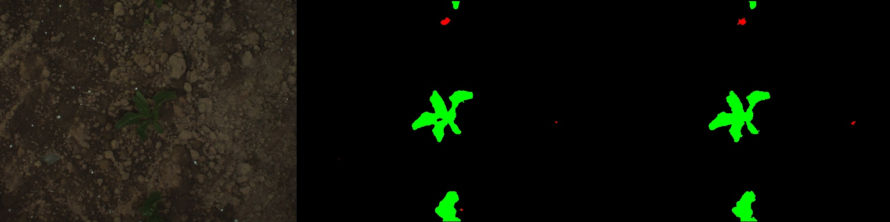

# Refinet: An encoder-decoder structured deep neural net with refinement subnet for real-time semantic segmentation


Sample segmentation results on Cityscapes dataset.


Sample segmentation results on Synthia dataset.


Sample segmentation results on Bonn Crop Weed dataset.


## Description

This is an implementation code of our paper "Refinet: An encoder-decoder structured deep neural net with refinement subnet for real-time semantic segmentation". Refinet is an encoder-decoder structured DNN to solve the real-time semantic segmentation task. Compared to conventional DNNs for real-time semantic segmentation, Refinet improve the segmentation accuracy further by the introduced refinement subnet. The refinement subnet takes advantage of the high spatial resolution of the encoded features from the first encoder layer, corrects and refines finer details in the image. Though Refinet introduces marginal increase in execution time, it does not affect its real-time camera-frame-rate operation.

This implementation code is based on __Bonnet__ (https://github.com/PRBonn/bonnet)

This scripts have been tested on the following hardware setup:
- x86 Ubuntu 16.04 with an NVIDIA GTX1080Ti GPU (nvidia-375, CUDA9, CUDNN7, TF 1.7, TensorRT3)

## installation

- Python stuff (and tf profiler):
  
```sh
  $ sudo apt install libav-tools ffmpeg libcupti-dev
  $ sudo pip3 install -r requirements.txt
  $ export PYTHONPATH=/usr/local/lib/python3.5/dist-packages/cv2/:$PYTHONPATH # Needed if you have ROS Kinetic installed
```
- Tensorflow (Follow link, it is complete for install of CUDA, CUDNN, etc): [Link](https://www.tensorflow.org/install/install_linux)

## Traininig

Please follow the following commands to train the Refinet.

_e.g._ Cityscapes Dataset (Synthia and Bonn Crop Weed Datasets can be processed similarly):
$ cd train_py

1) to pretrain the main segmentation subnet:
$ train.py -d cfg/cityscapes/data.yaml -n cfg/cityscapes/net_pretrain.yaml -t cfg/cityscapes/train_pretrain.yaml -l LOD_DIR -p PRE_TRAIN_WEIGHTS_DIR (check Pre-trained models below)

2) to train the refinement subnet:
Do the following change to the file train_py/arch/abstract_net_cascaded.py
self.fine_tune_on = 0
$ train.py -d cfg/cityscapes/data.yaml -n cfg/cityscapes/net.yaml -t cfg/cityscapes/train_pretrain.yaml -l LOD_DIR -p RESULTS_FROM_PREVIOUS_STEP

3) to finetune the whole net:
Do the following change to the file train_py/arch/abstract_net_cascaded.py
self.fine_tune_on = 1
$ train.py -d cfg/cityscapes/data.yaml -n cfg/cityscapes/net.yaml -t cfg/cityscapes/train_finetuen.yaml -l LOD_DIR -p RESULTS_FROM_PREVIOUS_STEP

#### Pre-trained models

These are some models trained on some sample datasets that you can use with the trainer and deployer,
but if you want to take time to write the parsers for another dataset (yaml file with classes and colors + python script to
put the data into the standard dataset format) feel free to create a pull request.

- Cityscapes:
  - 512x256 [Link](http://www.ipb.uni-bonn.de/html/projects/bonnet/pretrained-models/v0.2/city_512.tar.gz)
- Synthia:
  - 512x384 [Link](http://www.ipb.uni-bonn.de/html/projects/bonnet/pretrained-models/v0.2/synthia_512.tar.gz)
- Crop-Weed (CWC):
  - 512x384 [Link](http://www.ipb.uni-bonn.de/html/projects/bonnet/pretrained-models/v0.2/cwc_512.tar.gz)

## Citation

If you use our framework for any academic work, please cite the following two papers: 

__Refinet__: TBC.

__Bonnet__: [paper](http://www.ipb.uni-bonn.de/wp-content/papercite-data/pdf/milioto2019icra.pdf).

```
@InProceedings{milioto2019icra,
author = {A. Milioto and C. Stachniss},
title = {{Bonnet: An Open-Source Training and Deployment Framework for Semantic Segmentation in Robotics using CNNs}},
booktitle = {Proc. of the IEEE Intl. Conf. on Robotics \& Automation (ICRA)},
year = 2019,
codeurl = {https://github.com/Photogrammetry-Robotics-Bonn/bonnet},
videourl = {https://www.youtube.com/watch?v=tfeFHCq6YJs},
}
```

Bonnet is also based on the following architectures, so if you use them for any academic work, please give a look at their papers and cite them if you think proper:

- SegNet: [Link](https://arxiv.org/abs/1511.00561)
- E-Net: [Link](https://arxiv.org/abs/1606.02147)
- ERFNet: [Link](http://www.robesafe.uah.es/personal/eduardo.romera/pdfs/Romera17tits.pdf)
- PSPNet [Link](https://arxiv.org/abs/1612.01105)
